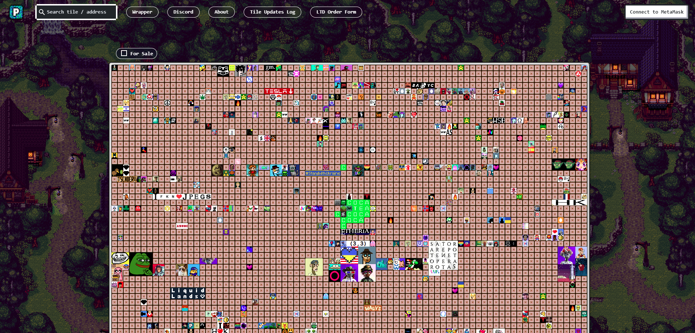

# Solana PixelMap.io

## What is PixelMap.io?

A little over decades ago, [Alex Tew](https://en.wikipedia.org/wiki/Alex_Tew) created a website called [MillionDollarHomePage.com](http://www.milliondollarhomepage.com/). The page features a 1000x1000 pixel grid, containing a total of 1,000,000 pixels, which were sold for $1 each. Since individual pixels were too small to be visible, they were sold in 10x10 pixel blocks for $100 each. Purchasers provided a 10x10 pixel image and could also include a URL for their block. Once configured, the image and ownership of the block could never be changed.

PixelMap.io is similar to the MillionDollarHomepage in many ways. It offers 1,016,064 pixels for sale on a 1,296 x 784 grid, divided into 3,969 16x16 tiles, each initially priced at 2 Ethereum. Unlike MillionDollarHomepage.com, however, every tile on PixelMap.io is controlled by a single contract on the Ethereum Blockchain. This provides several benefits.

## Solana Benefit

Solana can support more than 2,600 transactions per second compared to only about 15 transactions for Ethereum. Solana's proof-of-history (PoH) and proof-of-stake (PoS) models verify transactions based on coin ownership. This ease of verification also helps Solana have lower fees than Ethereum.
